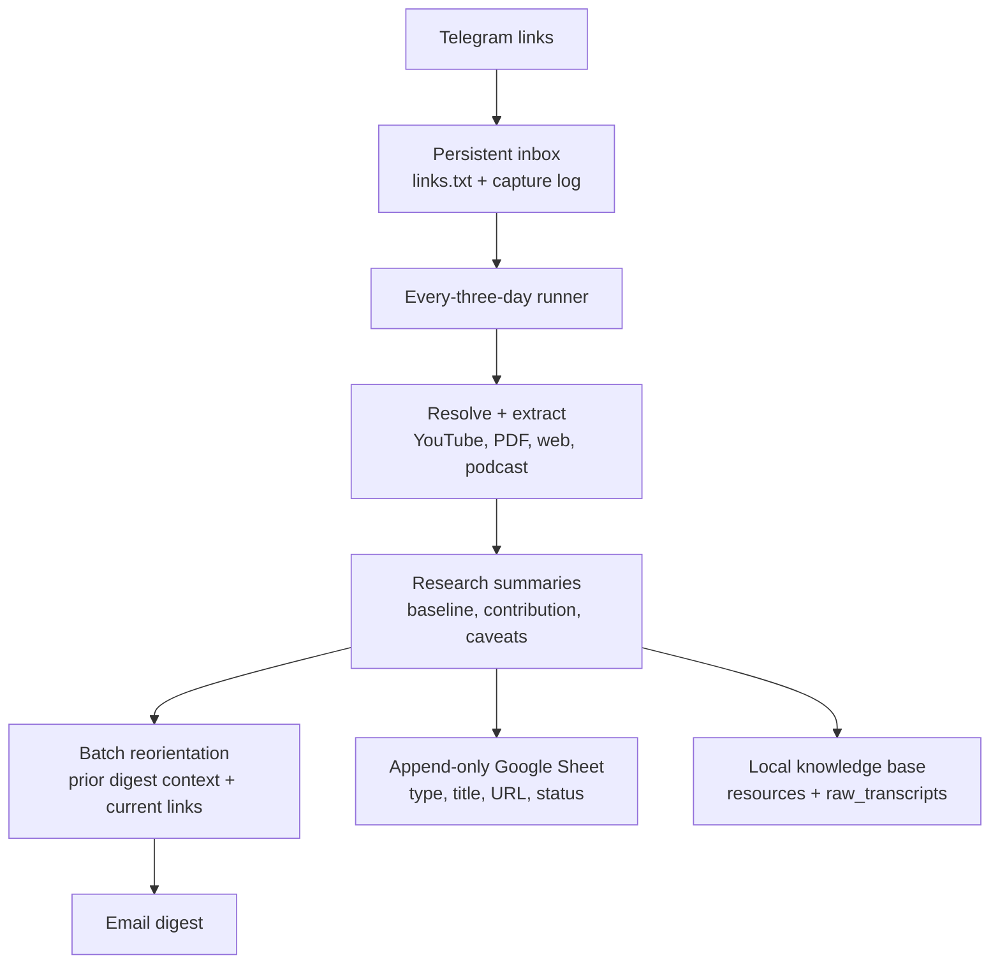

# AI Weekly Reads

AI Weekly Reads turns a high-volume Telegram link stream into a research reorientation digest. It keeps the links, handles YouTube/PDF/web sources, summarizes them around what was already known and what each source adds, and sends the result by email every three days.

## Read It

- **Substack:** [AI Weekly Reads](https://aiweeklyreads.substack.com/)
- **Latest GitHub edition:** [`latest.md`](latest.md)
- **Latest EPUB:** [`latest.epub`](latest.epub)
- **Latest weekly GitHub edition:** [`weekly/latest.md`](weekly/latest.md)
- **Latest weekly EPUB:** [`weekly/latest.epub`](weekly/latest.epub)
- **Latest one-shot GitHub edition:** [`one-shot/latest.md`](one-shot/latest.md)
- **Latest one-shot EPUB:** [`one-shot/latest.epub`](one-shot/latest.epub)
- **Kindle:** public EPUBs at [`latest.epub`](latest.epub), [`weekly/latest.epub`](weekly/latest.epub), and [`one-shot/latest.epub`](one-shot/latest.epub) when available, with optional private send-to-Kindle delivery

The public GitHub edition is intentionally rolling:

- Every public build refreshes the top-level `latest.md` and `latest.epub`.
- Weekly runs replace `weekly/latest.md` and `weekly/latest.epub`.
- One-shot playlist runs replace `one-shot/latest.md` and `one-shot/latest.epub`.

The active delivery path is:

- **Capture:** send links to Telegram; the webhook appends them to `inbox/links.txt` and `inbox/link_capture.jsonl`
- **Reorientation:** the scheduled runner summarizes each queued source and synthesizes it against prior digest context
- **Delivery:** the runner appends one typed row per link to Google Sheets, then emails one research digest

Kindle ebook delivery is paused. The older EPUB/Kindle builders remain available for later, but no active workflow invokes them.

## What Gets Covered

Recurring sources live in [`config/sources.json`](config/sources.json). The weekly run looks back through each source, filters to the configured publication window, skips already-processed items, and summarizes new items.

Sources are grouped by editorial type, then fetched through the most reliable upstream for that source. Podcast RSS is preferred when it exists because it carries cleaner episode dates, audio URLs, and show metadata. Some podcast-style shows are still sourced from YouTube because the YouTube channel or playlist is the better upstream for that show.

### YouTube Channels

- [aiDotEngineer](https://www.youtube.com/@aiDotEngineer)
- [Cursor](https://www.youtube.com/@cursor_ai/videos)
- [Stripe](https://www.youtube.com/@stripe/videos)
- [Vanishing Gradients livestreams](https://www.youtube.com/@vanishinggradients/streams)
- [Claude livestreams](https://www.youtube.com/@claude/streams)
- [Stanford Online](https://www.youtube.com/@stanfordonline/)

### Podcasts And Podcast-Style Sources

- [Lenny's Podcast](https://www.lennysnewsletter.com/podcast)
- [Lex Fridman Podcast](https://lexfridman.com/podcast/)
- [Latent Space](https://www.youtube.com/@LatentSpacePod)
- [Training Data](https://www.youtube.com/playlist?list=PLOhHNjZItNnMm5tdW61JpnyxeYH5NDDx8)
- [No Priors](https://www.youtube.com/@NoPriorsPodcast)
- [Unsupervised Learning](https://www.youtube.com/@RedpointAI)
- [The MAD Podcast with Matt Turck](https://www.youtube.com/@DataDrivenNYC/videos)
- [AI & I by Every](https://www.youtube.com/playlist?list=PLuMcoKK9mKgHtW_o9h5sGO2vXrffKHwJL)

One-off links can also be added to `inbox/links.txt`, and one-shot YouTube playlists can be processed with `scripts/build_playlist_digest.py`.

## How It Works



The project is local-first. Raw transcripts, resource notes, generated EPUBs, private settings, browser sessions, and delivery ledgers are ignored by Git. The repository stores the workflow, prompts, source registry, and the current rolling public editions.

## How YouTube And Podcasts Are Processed

After capture, every queued item goes through the same research pipeline: stable ID, source resolution, transcript/PDF extraction, research-oriented summary, resource-note write, batch reorientation, Google Sheets append, and email delivery. The queue is only cleared after both Sheet and email delivery succeed.

### YouTube

1. The weekly run collects recent video URLs from configured channels or playlists with `yt-dlp --flat-playlist`.
2. Each URL is resolved into a media item with `yt-dlp` metadata such as title, channel name, description, and upload date.
3. If a raw transcript is already cached locally, it is reused.
4. Otherwise the workflow tries YouTube captions first.
5. If captions are missing and Mistral transcription is enabled, it downloads the audio and transcribes that file.
6. The transcript is stored locally, summarized, and written into the weekly outputs.

### Podcasts

1. The weekly run fetches configured RSS feeds and turns each recent entry into a media item using the feed GUID, link, or enclosure URL as the stable key.
2. The feed entry supplies the episode title, published date, description, and audio enclosure when available.
3. If a raw transcript is already cached locally, it is reused.
4. Otherwise the workflow looks for a transcript embedded in the publisher description first.
5. If no publisher transcript is present and Mistral transcription is enabled, it tries the remote audio URL directly, then falls back to downloading the media file and transcribing that file.
6. The transcript is stored locally, summarized, and written into the weekly outputs.

YouTube captions, publisher text, and PDFs are stored in the local knowledge base. Each summary explicitly covers `What Came Before`, `What This Adds`, `Why It Matters`, and `What To Watch`. The batch email reorients the current links against both recent digest state and the accumulated Obsidian resource notes, without sending raw transcripts into the synthesis prompt.

## Outputs

- `latest.md`: most recently refreshed public edition tracked in Git, regardless of weekly vs one-shot
- `latest.epub`: EPUB companion for the most recently refreshed public edition when available
- `weekly/latest.md`: current summaries-only weekly public edition tracked in Git
- `weekly/latest.epub`: current weekly public Kindle-friendly EPUB tracked in Git
- `one-shot/latest.md`: current public one-shot playlist edition tracked in Git
- `one-shot/latest.epub`: current public one-shot playlist EPUB tracked in Git when available
- `output/kindle-digest-YYYY-MM-DD.md`: local weekly Markdown book
- `output/kindle-digest-YYYY-MM-DD.epub`: Kindle-friendly EPUB when `pandoc` is installed
- `output/substack/latest.md`: current Substack-ready post
- `knowledge_base/resources/`: local clean reading notes for Obsidian
- `knowledge_base/raw_transcripts/`: local raw transcript/text archive

## Research Digest Run

The active runner checks the queue and sends only when the three-day interval is due:

```bash
.venv/bin/python scripts/research_digest.py
```

For a manual test/send:

```bash
.venv/bin/python scripts/research_digest.py --force
```

GitHub Actions checks the queue daily, while `inbox/research_state.json` enforces a true three-day interval. Delivery uses the existing Google Apps Script authorization for both email and Sheets, so no local Google OAuth setup is required. Links remain queued unless Apps Script confirms both operations succeeded.

### Legacy Builders

```bash
.venv/bin/python scripts/process_inbox_batch.py
```

The old EPUB, Kindle, playlist, and Substack commands remain for backward compatibility but are not part of the active Telegram workflow.

## Setup

Create the primary virtual environment and install dependencies:

```bash
python3 -m venv .venv
.venv/bin/pip install -r requirements.txt
```

The active email workflow does not require Pandoc. EPUB generation is only needed for the paused legacy Kindle path.

## Configuration

Start from the example files:

```bash
cp config/settings.example.json config/settings.json
cp .env.example .env
cp inbox/links.example.txt inbox/links.txt
```

Local-only files:

- `config/settings.json`: personal settings
- `.env`: API keys and delivery settings
- `inbox/links.txt`: queued Telegram research links
- `inbox/link_capture.jsonl`: append-only Telegram capture metadata
- `inbox/archive.txt`: successfully emailed links
- `config/private/`: Google OAuth tokens and Substack browser profile

Important settings in `config/settings.json`:

- `email`: recipient, sender, and Gmail API/SMTP delivery settings
- `google_sheets`: required append-only sheet settings; if no spreadsheet ID is supplied, the first run creates one and persists its ID in `inbox/research_state.json`
- `publication_window_days`: legacy recurring-source window
- `weekly_resource_limit`: legacy weekly-book limit
- `max_items_per_run`: optional cost/safety cap; `0` means no cap
- `kindle.enabled`: leave false while email is the active delivery path

Per-source settings in `config/sources.json`:

- `lookback_count`: how many recent items to inspect for that source before publication-date filtering

## Services

### Mistral

`MISTRAL_API_KEY` enables AI summaries and transcription fallback.

```bash
MISTRAL_API_KEY=your-api-key
```

Default models are configured in `config/settings.json`:

- summaries: `mistral-small-latest`
- fallback summaries: `mistral-medium-latest` when a batch job fails or returns unusable structured summaries
- transcription: configurable in `config/settings.json`

### Email

Set these values for the active research delivery path:

```bash
EMAIL_ENABLED=true
EMAIL_DELIVERY_METHOD=smtp
EMAIL_RECIPIENT=you@example.com
EMAIL_SENDER=you@example.com
EMAIL_SMTP_HOST=smtp.gmail.com
EMAIL_SMTP_PORT=587
EMAIL_SMTP_USERNAME=you@example.com
EMAIL_SMTP_PASSWORD=your-app-password
```

Gmail API delivery is also supported. Set `EMAIL_DELIVERY_METHOD=gmail_api`, configure `GOOGLE_CREDENTIALS_PATH` and `GOOGLE_TOKEN_PATH`, then authorize once:

```bash
.venv/bin/python scripts/setup_google_oauth.py
```

### Google Sheets

Enable the append-only link index with:

```bash
GOOGLE_SHEETS_ENABLED=true
GOOGLE_SHEETS_SPREADSHEET_ID=optional-existing-sheet-id
GOOGLE_SHEETS_WORKSHEET=Links
```

The OAuth token must include both Gmail send and Google Sheets scopes. Google Sheets is required: the digest will not send or clear the queue until the row append succeeds. If no spreadsheet ID is supplied, the first successful run creates `AI Research Link Library`, records its URL in `inbox/research_state.json`, and appends future rows to it. Each row records capture time, type (`yt`, `pdf`, `link`, `podcast`, or `x`), title, URL, source, publication date, extraction method, summary status, and digest date.

The GitHub workflow uses the existing Apps Script deployment. It needs the existing `GEMINI_API_KEY` and `GITHUB_PAT` repository secrets; Apps Script uses its existing authorization and the `GITHUB_PAT` value as the delivery secret unless `RESEARCH_DIGEST_SECRET` is configured as a script property.

Kindle delivery is disabled in the active workflows. Do not set `KINDLE_ENABLED=true` unless you intentionally restore that path.

### Substack

Substack support has two separate steps:

1. Generate a Substack-ready Markdown post at `output/substack/latest.md`
2. Optionally publish it through a dedicated Playwright browser profile

Local setup:

```bash
python3 -m venv .venv-substack
.venv-substack/bin/pip install -r requirements-substack.txt
PLAYWRIGHT_BROWSERS_PATH=.venv-substack/ms-playwright .venv-substack/bin/playwright install chromium
PLAYWRIGHT_BROWSERS_PATH=.venv-substack/ms-playwright .venv-substack/bin/python scripts/create_substack_draft.py --setup
```

The browser session is stored under `config/private/substack/browser` and ignored by Git. You should only need to log in again if Substack expires or challenges the session.

## Obsidian Knowledge Base

Open `knowledge_base/` as an Obsidian vault.

The vault contains:

- resource notes with summaries, Q&A, takeaways, speaker metadata, and topic tags
- raw transcript notes stored separately
- generated source, people, topic, and index notes
- weekly books under `knowledge_base/weekly_books/`

The generated graph preset hides storage details such as raw transcripts, sources, people, weekly compilations, templates, indexes, and repository files. The goal is for the graph to show knowledge relationships, mainly resources connected to topic hubs.

## Project Layout

- `config/sources.json`: recurring source registry
- `config/settings.example.json`: shareable settings template
- `inbox/links.example.txt`: shareable inbox template
- `scripts/research_digest.py`: three-day research email runner
- `scripts/research_delivery.py`: email and Google Sheets delivery
- `scripts/handle_webhook.py`: Telegram link capture
- `scripts/setup_google_oauth.py`: combined Gmail/Sheets OAuth setup
- `scripts/pipeline.py`: legacy weekly update/build/send workflow
- `scripts/build_playlist_digest.py`: one-shot YouTube playlist runner
- `scripts/create_substack_draft.py`: Substack browser draft/publish automation
- `scripts/send_to_kindle.py`: paused legacy Kindle delivery
- `scripts/resources.py`: resource note writer
- `scripts/digest.py`: weekly book builder
- `prompts/`: research summary and batch reorientation prompts
- `assets/kindle.css`: Kindle EPUB stylesheet

## Maintenance

Run local checks:

```bash
.venv/bin/python -m py_compile scripts/*.py scripts/transcription/*.py
.venv/bin/python scripts/check_repo_health.py
.venv/bin/python scripts/audit_knowledge_base.py
```

Normalize Obsidian metadata after hand edits or migrations:

```bash
.venv/bin/python scripts/normalize_knowledge_base.py
```

GitHub Actions captures Telegram links and runs the three-day research email workflow. It also maintains the queue/archive state. Kindle delivery is not invoked.
